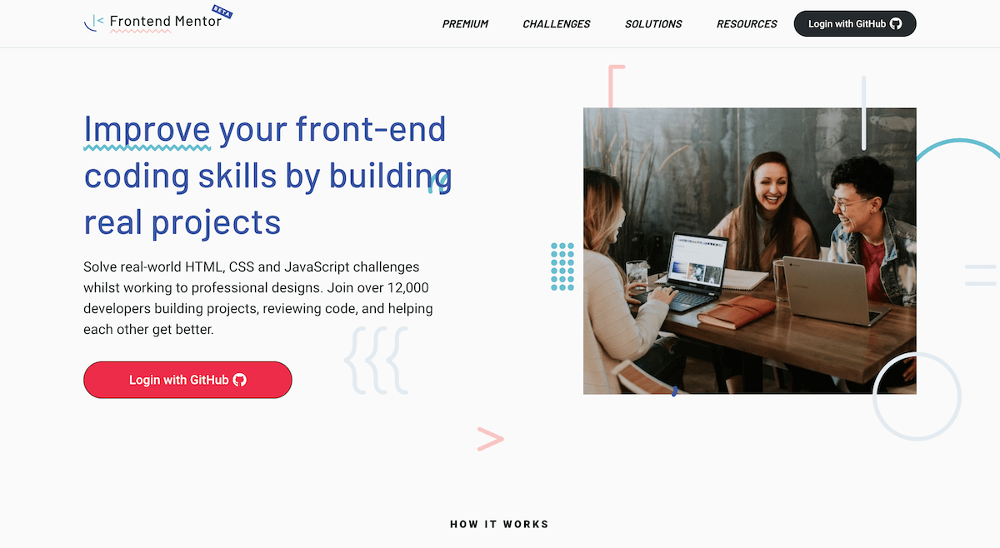

# Frontend Mentor

   
    

 
 
Este repositório foi criado para exibir minhas resoluções dos desafios proposto pelo Frontend Mentor.

## 🤔 Mas o que é o Frontend Mentor? 
O <a  href="https://www.frontendmentor.io/"> Frontend Mentor</a> é um site que permite ter acesso a diversos desafios envolvendo <b>HTML, CSS e JS</b> com o objetivo de aprimorar as habilidades na área.

## :rocket: Desafios 
É possível visualizar as propostas do Frontend Mentor de cada desafio clicando no link correspondente:

<a href="https://www.frontendmentor.io/challenges/pricing-component-with-toggle-8vPwRMIC">Challenge-01</a>

<a href="https://www.frontendmentor.io/challenges/insure-landing-page-uTU68JV8">Challenge-01</a>

## 💻 Projeto
Para fazer o deploy dos projetos, foi utilizado a plataforma Netlify.

<a href="https://frontendmentor-challenge01.netlify.app/">Deploy Challenge-01</a>

<a href="https://frontendmentor-challenge02.netlify.app/">Deploy Challenge-02</a>

